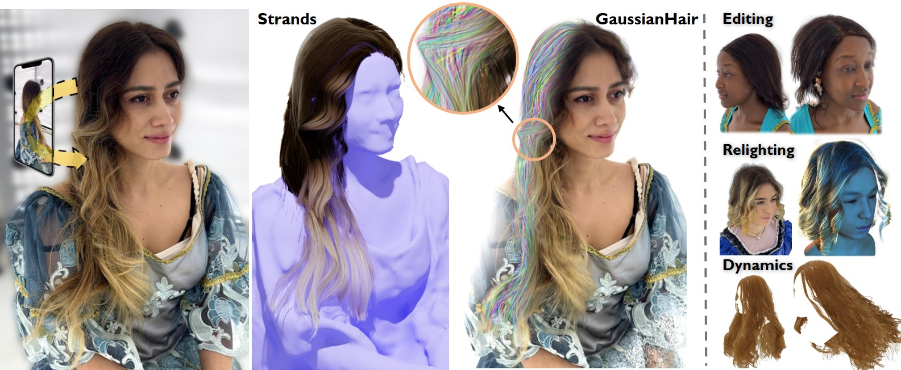

<!-- PROJECT LOGO -->
<br />
<p align="center">

  <h1 align="center">GaussianHair: Hair Modeling and Rendering with Light-aware Gaussians </h1>

  <p align="center">
    
  </p>
  <p align="center">
    <!-- ICCP, 2021 -->
    <br />
    <a href="https://HaiminLuo.github.io"><strong>Haimin Luo</strong></a>
    ·
    <a href=""><strong>Min Ouyang</strong></a>
    ·
    <a href=""><strong>Zijun Zhao</strong></a>
    ·
    <a href="https://suezjiang.github.io/"><strong>Suyi Jiang</strong></a>
    ·
    <a href="https://zhanglongwen.com/"><strong>Longwen Zhang</strong></a> 
    ·
    <a href="https://vic.shanghaitech.edu.cn/vrvc/en/people/qixuan-zhang/"><strong>Qixuan Zhang</strong></a>
    ·
    <a href="https://github.com/weiyang-hust"><strong>Wei Yang</strong></a>
    ·
    <a href="http://xu-lan.com/"><strong>Lan Xu</strong></a>
    ·
    <a href="http://www.yu-jingyi.com/cv/"><strong>Jingyi Yu</strong></a>
  </p>

  <p align="center">
    <!-- <a href="https://pytorch.org/get-started/locally/"></a><br><br> -->
    <a href='https://arxiv.org/abs/2402.10483'>
      
    </a>
    <a href='https://haiminluo.github.io/publication/gaussianhair/' style='padding-left: 0.5rem;'>
      
    <a href='https://haiminluo.github.io/publication/gaussianhair/' style='padding-left: 0.5rem;'>
      
    </a>
  </p>
</p>

<br />

This repository contains a pytorch implementation for the paper: [GaussianHair: Hair Modeling and Rendering with Light-aware Gaussians](https://arxiv.org/abs/2402.10483). This paper presents GaussianHair, a novel explicit hair representation. It enables comprehensive modeling of hair geometry and appearance from images, fostering innovative illumination effects and dynamic animation capabilities.

Comming soon...


## Citation
If you find our code or paper helps, please consider citing:
```
@article{luo2024gaussianhair,
  title={GaussianHair: Hair Modeling and Rendering with Light-aware Gaussians},
  author={Luo, Haimin and Ouyang, Min and Zhao, Zijun and Jiang, Suyi and Zhang, Longwen and Zhang, Qixuan and Yang, Wei and Xu, Lan and Yu, Jingyi},
  journal={arXiv preprint arXiv:2402.10483},
  year={2024}
}
```